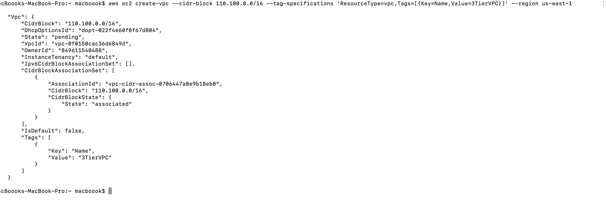

### AWS THREE TIER ARCHITECTURE PROVISIONED WITH AWS-CLI
### Summary
This project implements a 3-tier architecture on AWS to simulate a real-world, scalable cloud environment for web applications,separating the presentation, application, and data layers for better security, maintainability, and performance. By using AWS-CLI Commands, the infrastructure is automated, consistent, repeatable, and easily version-controlled, reducing manual errors and accelerating deployment in both development and production environments.
### Infrastructure Planning

1. Set up your development environment
   - Install AWS CLI
   - Configure AWS credentials
   - Install your chosen IAC tool

2. Design your architecture
   -  VPC with public and private subnets across multiple AZs
   -  Web tier in public subnets
   -  Application tier in private subnets
   -  Database tier in private subnets

3. Create CLI templates/code
   - Define network infrastructure
   - Configure security groups
   - Set up load balancers
   - Create compute resources
   - Configure database
   - Set up auto-scaling

4. Deploy and test
   - Deploy infrastructure
   - Validate connectivity between tiers
   - Test failover scenarios

### Step1. Install AWS Cli
install aws-cli using the official documentation on aws

### Step 2. Configure aws cli 
- run the bash command: ```aws configure``` 
* you will be prompted to enter:
- AWS Access Key ID: click your aws account profile and narrow down to ```Security credentials``` and click, scoll down to create secret access key and create.
copy your access key (the visible key:eg AKIA...)

- AWS Secret Access Key: in the same access key copy the Secret Access Key (invisblekey)and past. enter

- Default region name:  us-east-1 (or type your prefered region) enter

- Default output format: json

### Step 3. Create a vpc 
-  Run this bash command to create vpc: ```aws ec2 create-vpc --cidr-block 110.100.0.0/16 --tag-specifications 'ResourceType=vpc,Tags=[{Key=Name,Value=3TierVPC}]' --region us-east-1 ``` 


- Copy Down your vpc ID

###  Enable DNS Support and Hostnames for VPC
- run this bash command to enable-dns-support: ```aws ec2 modify-vpc-attribute --vpc-id <vpc id> --enable-dns-support --region us-east-1```

- To enable-dns-hostnames run this barsh commad: ```aws ec2 modify-vpc-attribute --vpc-id <vpc ID> --enable-dns-hostnames --region us-east-1```

### Step 3. Create Internet Gateway and Attach to VPC
- Run the bash comman to create a security group: ```aws ec2 create-internet-gateway --tag-specifications 'ResourceType=internet-gateway,Tags=[{Key=Name,Value=3TierIGW}]' --region us-east-1``` note: copy down you igw ID



- Export the igw ID: ```export IGW_ID=$(aws ec2 describe-internet-gateways --filters "Name=tag:Name,Values=3TierIGW" --query "InternetGateways[0].InternetGatewayId" --output text --region us-east-1)```

- Attach the Internet- gateway to the vpc: ```aws ec2 attach-internet-gateway \
  --internet-gateway-id igw-<igw ID> \
  --vpc-id vpc-<VPC ID> \
  --region us-east-1```

  ### Step 4. Create Subnets
- 1. Web Tier: (Public Subnets 1)
- To create a subnet run this bash command: 
```bash
aws ec2 create-subnet \
  --vpc-id vpc-0f0150cac36d6849d \
  --cidr-block 110.100.30.0/20 \
  --availability-zone us-east-1a \
  --tag-specifications 'ResourceType=subnet,Tags=[{Key=Name,Value=Public-Subnet-1}]' \ --region us-east-1
  ```

  

### Export the subnets:
  - App subnet1: 

  ```bash
  export APP_SUBNET_1=$ aws ec2 describe-subnets --filters "Name=tag:Name,Values=Private-Subnet-1-App" --query "Subnets[0].SubnetId" --output text --region us-east-1
  ```


- 2. ### Public subnet 2
- Run this command: 
```bash
 aws ec2 create-subnet   --vpc-id vpc-0f0150cac36d6849d   --cidr-block 110.100.40.0/20   --availability-zone us-east-1a   --tag-specifications 'ResourceType=subnet,Tags=[{Key=Name,Value=Public-Subnet-2}]'   --region us-east-1
```


### Export subnet:

```bash
export APP_SUBNET_2=$(aws ec2 describe-subnets --filters "Name=tag:Name,Values=Private-Subnet-2-App" --query "Subnets[0].SubnetId" --output text --region us-east-1)
```

### App Tier (Private Subnets) 
- 1. Web app subnet 1 : 

```bash 
aws ec2 create-subnet \
  --vpc-id vpc-0f0150cac36d6849d \
  --cidr-block 110.100.50.0/20 \
  --availability-zone us-east-1a \
  --tag-specifications 'ResourceType=subnet,Tags=[{Key=Name,Value=Private-Subnet-1-App}]' \
  --region us-east-1
  ``` 


- 2. App subnet 2:
```bash
  ec2 create-subnet \
  --vpc-id vpc-0f0150cac36d6849d \
  --cidr-block 110.100.60.0/20 \
  --availability-zone us-east-1b \
  --tag-specifications 'ResourceType=subnet,Tags=[{Key=Name,Value=Private-Subnet-2-App}]' \
  --region us-east-1
  ```


- ### Export the the subnets: 

- App subnet 1: 
```bash
export APP_SUBNET_1=$(aws ec2 describe-subnets --filters "Name=tag:Name,Values=Private-Subnet-1-App" --query "Subnets[0].SubnetId" --output text --region us-east-1)
```
- App subnet 2:

```bash
export APP_SUBNET_2=$(aws ec2 describe-subnets --filters "Name=tag:Name,Values=Private-Subnet-2-App" --query "Subnets[0].SubnetId" --output text --region us-east-1)
```
###  Database Tier (Private Subnets)

- 1. Private subnet 1:

 ```bash
 aws ec2 create-subnet \
  --vpc-id vpc-0f0150cac36d6849d \
  --cidr-block 110.100.70.0/20 \
  --availability-zone us-east-1a \
  --tag-specifications 'ResourceType=subnet,Tags=[{Key=Name,Value=Private-Subnet-1-DB}]' \--region us-east-1
  ```

  

- Export subnet:
```bash
export DB_SUBNET_1=$(aws ec2 describe-subnets --filters "Name=tag:Name,Values=Private-Subnet-1-DB" --query "Subnets[0].SubnetId" --output text --region us-east-1)
```


### Database subnet2:

```bash
aws ec2 create-subnet --vpc-id vpc-0f0150cac36d6849d  --cidr-block 110.100.90.0/20 --availability-zone us-east-1b --tag-specifications 'ResourceType=subnet,Tags=[{Key=Name,Value=Private-Subnet-2-DB}]' --region us-east-1
```


- Export subnet:

```bash
macboook$ export DB_SUBNET_2=$(aws ec2 describe-subnets --filters "Name=tag:Name,Values=Private-Subnet-2-DB" --query "Subnets[0].SubnetId" --output text --region us-east-1)
```

### Step 5. Create Route Tables and Routes. (Public Route Table)
- Create a route Table:

```bash
 aws ec2 create-route-table \
  --vpc-id vpc-<vpc-ID> \
  --region us-east-1
```

- Export route: 

```bash
export PUBLIC_RT=$(aws ec2 describe-route-tables --filters "Name=tag:Name,Values=Public-RT" --query "RouteTables[0].RouteTableId" --output text --region us-east-1)
```

- Attach your route to internet gateway:

```bash
aws ec2 create-route \
  --route-table-id rtb-<route-table ID> \
  --destination-cidr-block 0.0.0.0/0 \
  --gateway-id igw-<igw-ID>\
  --region us-east-1
```
- Associate subnet (pubic-subnet-1):

``` bash
aws ec2 associate-route-table   --route-table-id rtb-<rtb-ID>   --subnet-id subnet-<public-subnet-i-ID>  --region us-east-1
```


- Associate The second public subnet:

```bash
aws ec2 associate-route-table   --route-table-id rtb-<rtb-ID>   --subnet-id subnet-<second-public-subnet-ID>   --region us-east-1
```


### Step 6. NAT Gateway for Private Subnets:
- Allocate ip:

```bash
aws ec2 allocate-address --domain vpc --region us-east-1
```


- Export allocated Ip:

```bash
export EIP_ALLOC=$(aws ec2 describe-addresses --query "Addresses[0].AllocationId" --output text --region us-east-1)
```

- Create a Net-gateway:
```bash
aws ec2 create-nat-gateway \
  --subnet-id subnet-<pubilc-subnet-ID> \
  --allocation-id eipalloc-<allocation-ID> \
  --tag-specifications 'ResourceType=natgateway,Tags=[{Key=Name,Value=3TierNAT}]' \
  --region us-east-1
```


- Export net-gateway:
```bash
export NAT_GW=$(aws ec2 describe-nat-gateways --filter "Name=tag:Name,Values=3TierNAT" --query "NatGateways[0].NatGatewayId" --output text --region us-east-1)
```
### Step 7. Private Route Table

- create a public route table: 
```bash
aws ec2 create-route-table \
  --vpc-id vpc-0f0150cac36d6849d \
  --region us-east-1
```


- export rout:
```bash
export PRIVATE_RT=$(aws ec2 describe-route-tables --filters "Name=tag:Name,Values=Private-RT" --query "RouteTables[0].RouteTableId" --output text --region us-east-1)
```

- Associate the private subnets (App Layer)

```bash
aws ec2 associate-route-table \
  --route-table-id rtb-<rtb-ID> \
  --subnet-id subnet-<subnet-ID> \
  --region us-east-1
```

- associte the second private subnets (App Layer)

```bash
aws ec2 associate-route-table \
  --route-table-id rtb-<private-rtb-id>\
  --subnet-id subnet-<subnet-ID> \
  --region us-east-1
```

- Associate Private Subnets (DB Layer):
```bash
aws ec2 associate-route-table \
  --route-table-id rtb-0a0d901414cfc44fa \
  --subnet-id subnet-0500dd44a3cec7d0c \
  --region us-east-1
```

- Associate second DB subnet:
```bash
aws ec2 associate-route-table \
  --route-table-id rtb-<rtb-ID> \
  --subnet-id subnet-<subnet-ID> \
  --region us-east-1
```

### Step 8. Create Security Groups

* ### Web Tier Security Group

```bash
aws ec2 create-security-group \
  --group-name WebServerSG \
  --description "Web Server Security Group" \
  --vpc-id vpc-<vpc-id> \
  --tag-specifications 'ResourceType=security-group,Tags=[{Key=Name,Value=WebServerSG}]' \
  --region us-east-1
```

- Export sg:
```bash
export WEB_SG=$(aws ec2 describe-security-groups --filters "Name=tag:Name,Values=WebServerSG" --query "SecurityGroups[0].GroupId" --output text --region us-east-1)

```

- Allow port:
```bash
aws ec2 authorize-security-group-ingress --group-id $WEB_SG --protocol tcp --port 80 --cidr 0.0.0.0/0 --region us-east-1
```

```bash
aws ec2 authorize-security-group-ingress --group-id $WEB_SG --protocol tcp --port 443 --cidr 0.0.0.0/0 --region us-east-1
```
###  App Tier Security Group

```bash
aws ec2 create-security-group \
  --group-name AppServerSG \
  --description "App Server Security Group" \
  --vpc-id vpc-<vpc-id> \
  --tag-specifications 'ResourceType=security-group,Tags=[{Key=Name,Value=AppServerSG}]' \
  --region us-east-1
```
Export sg: 
```bash
export APP_SG=$(aws ec2 describe-security-groups --filters "Name=tag:Name,Values=AppServerSG" --query "SecurityGroups[0].GroupId" --output text --region us-east-1)
```

Allow port:
```bash
aws ec2 authorize-security-group-ingress --group-id $APP_SG --protocol tcp --port 8080 --source-group $WEB_SG --region us-east-1
```

### Database Tier Security Group
```bash
aws ec2 create-security-group \
  --group-name DBSG \
  --description "Database Security Group" \
  --vpc-id vpc-0f0150cac36d6849d \
  --tag-specifications 'ResourceType=security-group,Tags=[{Key=Name,Value=DBSG}]' \
  --region us-east-1
```
- Export sg:
```bash
export DB_SG=$(aws ec2 describe-security-groups --filters "Name=tag:Name,Values=DBSG" --query "SecurityGroups[0].GroupId" --output text --region us-east-1)
```
- Allow port:
```bash
aws ec2 authorize-security-group-ingress --group-id $DB_SG --protocol tcp --port 3306 --source-group $APP_SG --region us-east-1
```
- Associate Database subnets:
```bash
aws rds create-db-subnet-group \
  --db-subnet-group-name db-subnet-group-1 \
  --db-subnet-group-description "Subnet group for RDS database" \
  --subnet-ids subnet-0500dd44a3cec7d0c subnet-014993f59230e7e18 \
  --region us-east-1
```
### Step 9. Create RDS Database Instance

- Create Database instance:
```bash
aws rds create-db-instance \
  --db-instance-identifier three-tier-db \
  --allocated-storage 20 \
  --db-instance-class db.t3.micro \
  --engine mysql \
  --master-username admin \
  --master-user-password YourStrongPassword123! \
  --db-subnet-group-name db-subnet-group-1 \
  --vpc-security-group-ids sg-<db-sg-id> \
  --multi-az \
  --region us-east-1
```


### Step 10. Create Application Load Balancer:

- create Application Load Balancer and attach to security group: 
```bash
aws elbv2 create-load-balancer \
  --name WebTierALB \
  --subnets subnet-0df5d8a3bd0192629 subnet-07432fec3c165e4ca \
  --security-groups sg-0fd5ab1e179eb818a \
  --region us-east-1
```


- Export load balancer:
```bash
export ALB_ARN=$(aws elbv2 describe-load-balancers --names WebTierALB --query "LoadBalancers[0].LoadBalancerArn" --output text --region us-east-1)
```

- Create Target Group:
```bash
aws elbv2 create-target-group \
  --name WebTierTargetGroup \
  --protocol HTTP \
  --port 80 \
  --vpc-id vpc-<vpc-ID> \
  --health-check-path / \
  --health-check-interval-seconds 30 \
  --health-check-timeout-seconds 5 \
  --healthy-threshold-count 2 \
  --unhealthy-threshold-count 5 \
  --target-type instance \
  --region us-east-1
```


- Export Target group: 
```bash
 export TG_ARN=$(aws elbv2 describe-target-groups --names WebTierTargetGroup --query "TargetGroups[0].TargetGroupArn" --output text --region us-east-1)
```
- Create listiner: 
```bash
aws elbv2 create-listener --load-balancer-arn $ALB_ARN --protocol HTTP --port 80 --default-actions Type=forward,TargetGroupArn=$TG_ARN --region us-east-1
```


### Step 11. Create Launch Templates for Auto Scaling Groups:

- 1. Web Tier Launch Template:

```bash
aws ec2 create-launch-template \
  --launch-template-name WebServerLaunchTemplate \
  --version-description "Web Tier Launch Template" \
  --launch-template-data '{
    "ImageId": "ami-0c2b8ca1dad447f8a",
    "InstanceType": "t3.micro",
    "SecurityGroupIds": ["sg-0fd5ab1e179eb818a"],
    "UserData": "IyEvYmluL2Jhc2gKeXVtIHVwZGF0ZSAteQp5dW0gaW5zdGFsbCAteSBodHRwZApzeXN0ZW1jdGwgc3RhcnQgaHR0cGQKc3lzdGVtY3RsIGVuYWJsZSBodHRwZA=="
  }' \
  --region us-east-1
```


Note: The UserData is base64 encoded and contains:
```bash
#!/bin/bash
yum update -y
yum install -y httpd
systemctl start httpd
systemctl enable httpd
```

- 2.  App Tier Launch Template:
```bash
aws ec2 create-launch-template \
  --launch-template-name AppServerLaunchTemplate \
  --version-description "App Tier Launch Template" \
  --launch-template-data '{
    "ImageId": "ami-0c2b8ca1dad447f8a",
    "InstanceType": "t3.small",
    "SecurityGroupIds": ["sg-0c60bd9409d834530"],
    "UserData": "IyEvYmluL2Jhc2gKeXVtIHVwZGF0ZSAteQp5dW0gaW5zdGFsbCAteSBqYXZhLTEuOC4wLW9wZW5qZGsK"
  }' \
  --region us-east-1
```


Note: The UserData is base64 encoded and contains:
```bash
#!/bin/bash
yum update -y
yum install -y java-1.8.0-openjdk
```

### Step 12. Create Auto Scaling Groups:

-  ### Web Tier Auto Scaling Group:
```bash
aws autoscaling create-auto-scaling-group \
  --auto-scaling-group-name WebServerASG \
  --launch-template LaunchTemplateName=WebServerLaunchTemplate,Version='$Latest' \
  --min-size 2 \
  --max-size 4 \
  --desired-capacity 2 \
  --vpc-zone-identifier "subnet-<websubnet-1(public-subnet-ID)>,subnet-<websubnet-2(public-subnet-ID)" \
  --target-group-arns arn:aws:elasticloadbalancing:us-east-1:849611540488:targetgroup/WebTierTargetGroup/5b109282c3f750ac \
  --region us-east-1
```
### App Tier Auto Scaling Group:

```bash
aws autoscaling create-auto-scaling-group \
  --auto-scaling-group-name AppServerASG \
  --launch-template LaunchTemplateName=AppServerLaunchTemplate,Version='$Latest' \
  --min-size 2 \
  --max-size 4 \
  --desired-capacity 2 \
  --vpc-zone-identifier "subnet-app-private-subnet-2-ID,subnet-<app-private-subnet-2-ID>" \
  --region us-east-1
```

### 13 Access Appliaction
``` bash
aws elbv2 describe-load-balancers --names WebTierALB --query "LoadBalancers[0].DNSName" --output text --region us-east-1
```


Note: Replace ami-0abcdef1234567890 with an actual AMI ID appropriate for your region and use case. Also, replace us-east-1 with your preferred region.

_ Three tier web application is created

can now view your work in the console


