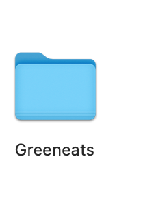
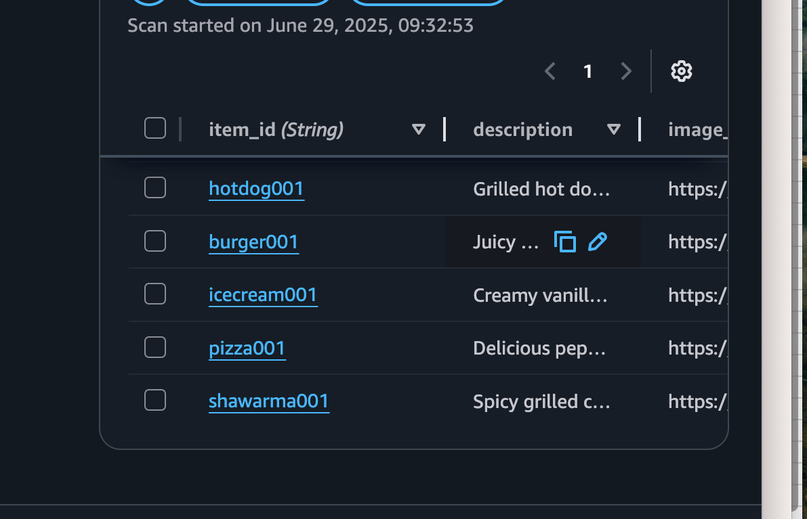
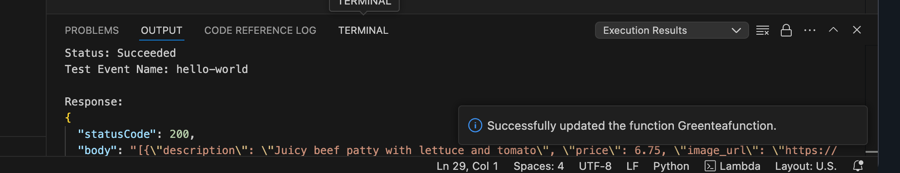
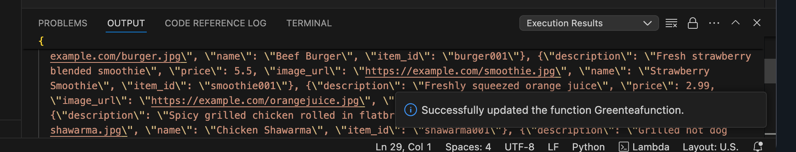
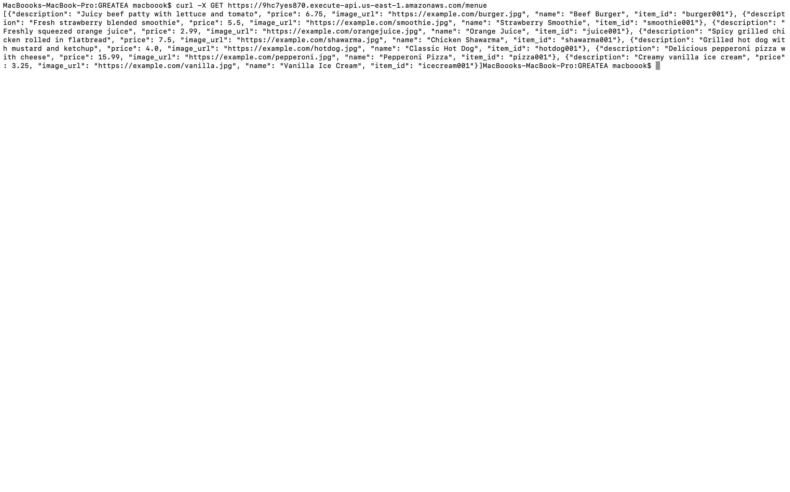

<<<<<<< HEAD
# *GREENEATS ONLINE FOOD Delivery*
*PER-REQUISITE*

   Knowledge of html: for frontend application

Lambda Functions: for Deploying code

Api: For colllecting information from html and send to Lambda

DynamoDB: for storing Data in the Database

Sns: for sending Real time notification

Sqs: FIFO

*LETS GET STARTED*

*Step 1.

On Your pic create new folder 




*after creating the new folder move to  (mac Text Editor) (Windows Notepad.)*

copy the code in the *index.html* and paste on your (Texteditor/ Notepad)

Save as index.html 

open on a brower


* STEPS 3.

Create a DynamoDB Table (i will be creating two tables one for orders and the other foe menue)

in your management console open DynamoDB and click on create item.

Table name: Menu

partition key: order id

and click create items 

now repet this step and create order table

Double click mene table and click on Explore Table 

click on create iteam insert each items on "DynamoDB" file one at a time 

now your table is create and iteams are inserted



* STEPS 4.

Create a Lambda function

function name: .......

Runtime: python 3.13

others in Default and then create.

in the Lambda code pest function code and test

To test 

click test at the top 

amd delete any function on the test code and typ:{}
Then test. output: Excution successful
Exite the test.

on the lambda: output




*STEPS 4.

Create an api

in your console ope api 

click on build api (http)

give your api a name 

click intergrate: add your lambda function and click next,

Roult: GET /menue (table name)

stage $default

create:

copy  your api url and your roult. use the curl command to test if tour api perfectly working.

```bash
curl -X GET https://9hc7yes870.execute-api.us-east-1.amazonaws.com/menue
```



STEPS 5.

Now head to VSCODE and install live server (vscode extenstion)and go live

[image](images/liveserver.png)

*Steps 6.

* CREATE AN SQS 

in your aws mangement console navigate to sqs 

SQS NAME:.....

FIFO

and create

* STEPS 6. 

CREATE AN SNS TOPIC

Sns name:.....

Standard: FIFO

attach the url of your SQS 

create topic 

at the sns mangement console click create notification.

Attach email address or mobile number (any one of choich for notification) a notifiaction message will be sent on you.

create


