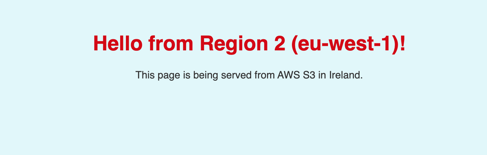

## Multi-Region Failover Web App (Resilience Project) 

#### OBJECT OF THIS PROJECT 

Deploy a website or web app in two or more AWS regions so that if one region fails, users are automatically routed to the other region with minimal downtime.

This is called a multi-region failover architecture — a key technique for building highly resilient applications.

#### Essenstial Benefit

Natural disasters or regional outages (e.g. AWS us-east-1 goes down)

Reduce single points of failure

Provide faster response times for global users

Meet business requirements for high availability (HA)

### Skills 

Troubleshooting:

Architecture Design:

Networking

Route 53:

 IAM & Security

  Lambda:

  index.html

  s3

### Step 1.

Prepare Your Static Web App Using index.html.

We will Create 2 html file one for USA the second for Europe

  NOTE: IF YOUR ARE USING A DYNAMIC SITE USE AMAZON ECS

 1. In Your Notedpad (Windows) or Text Editor (MacOS) copy and past the code in 
(index.htlm region 1)

Formate: Make Plain

and save as index-region1.html

Double click the file confirm its looks like this 

Recreate this steps the second time and also past the code in (region 2) and save as index-region2.html

### Step 2. Creating a Bucket

(create 2 s3 bucket one for us.east.1 the other for eu.west.one or any desired name region of your choice)

1. in the management console navigate to s3 

Create bucket

Region → US East (N. Virginia)

 Bucket Name: cloudsophiee-web-us-east-1

Uncheck Block all public access

Click create bucket.

2.  Bucket name → cloudsophiee-web-eu-west-1

Region → EU (Ireland)

Uncheck Block all public access

Click Create bucket

 Both buckets are now created.

 ### STEP 3 — Upload Files to Buckets

➤ Upload to us-east-1 bucket
Click bucket: cloudsophiee-web-us-east-1

Click [Upload]

Click [Add files] → choose index-region1.html

Click Upload

Upload to eu-west-1 bucket
Repeat The process

Upload index-region2.html

Both regions have their HTML files uploaded.

### Configure Bucket Policy for Public Access

Files won’t load publicly until you allow read access.

 us-east-1 Bucket Policy
Go to bucket: 
cloudsophiee-web-us-east-1

Click Permissions

Scroll down → Bucket policy

Click: Edit (copy your bucket ARN)

Click: policy generator 

Type of Policy: s3 Bucket Policy

Effect: Allow

Priciple: *

Action: Getobject

Amazon Resource Name: past your Bucket ARN you copied

Add statement and create policy 

copy the policy generated and pest on your s3 JSON

Click on save changes

Repeat this process on the europe s3 bucket

Both buckets now public

### To make static

Enable Static Website Hosting
 Enable for us-east-1
Go to bucket:

cloudsophiee-web-us-east-1
Click: Properties

Scroll down → Static website hosting

Click Edit

Choose:

Enable
Hosting type → Host a static website

Index document → index-region1.html

Click Save changes

Copy the website endpoint shown,

Test in browser → You should see:

Hello from Region 1

Repeat the process for Europe Region

Both S3 websites are online and public!

* Note: when enable the static website put the extact name of the file uploaded in that particular bucket 

### Step 3.

* ROUTE 53

