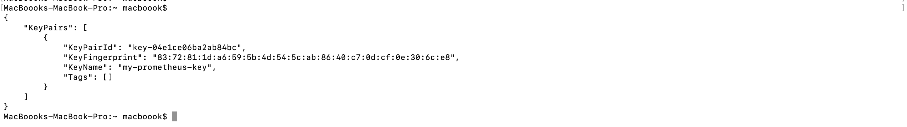
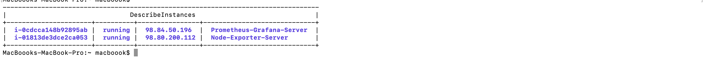
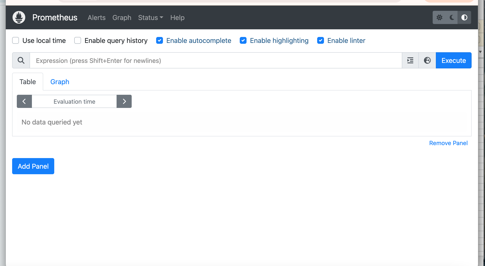
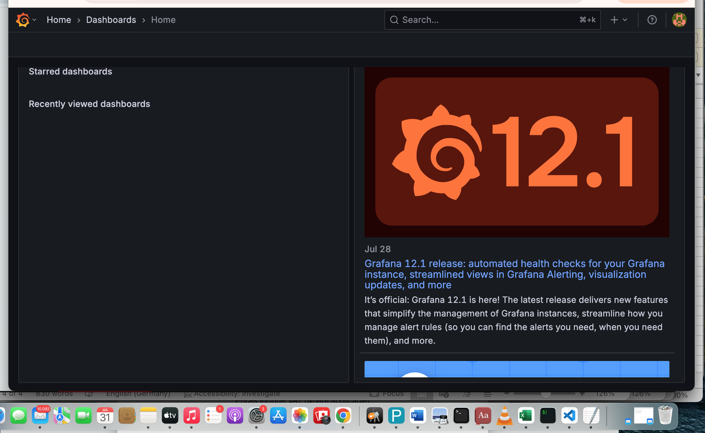
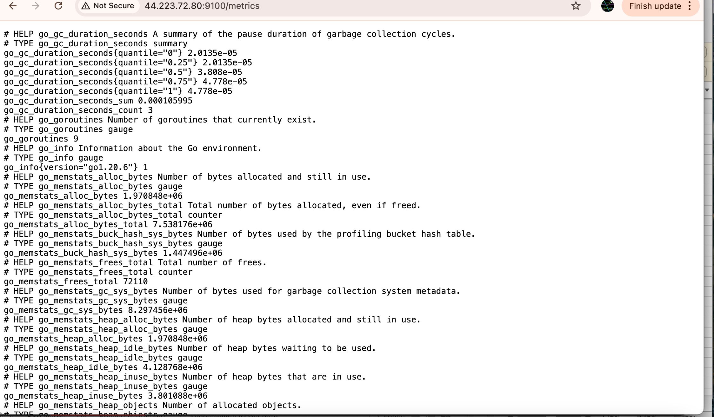
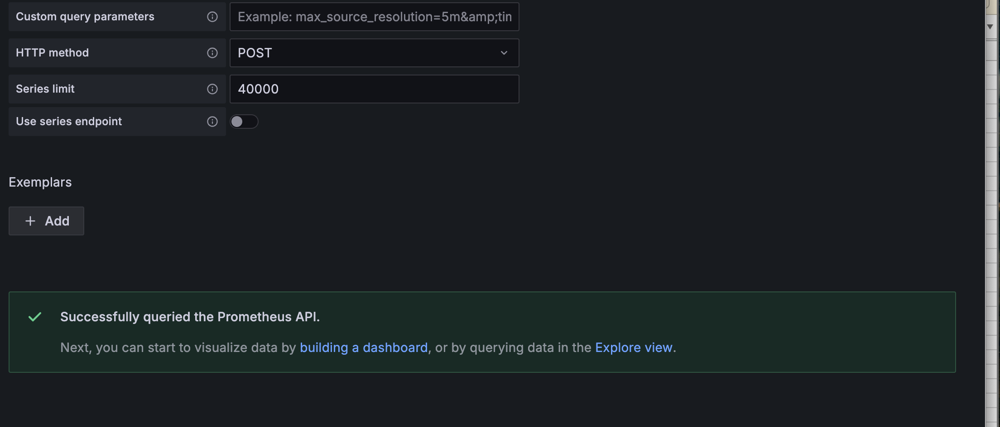
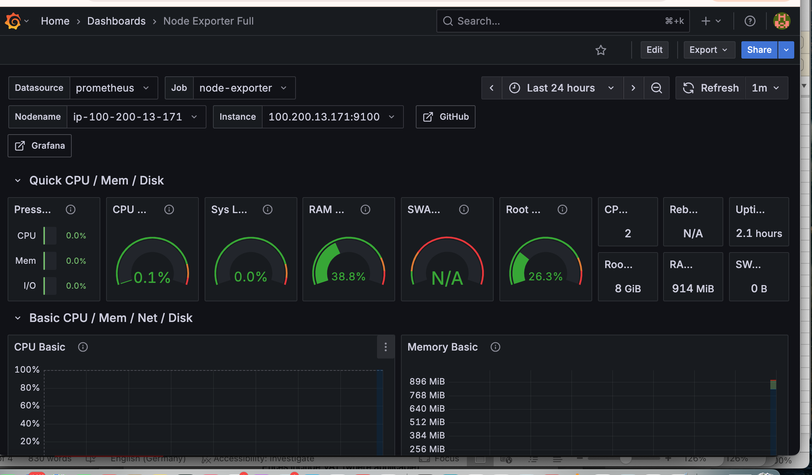
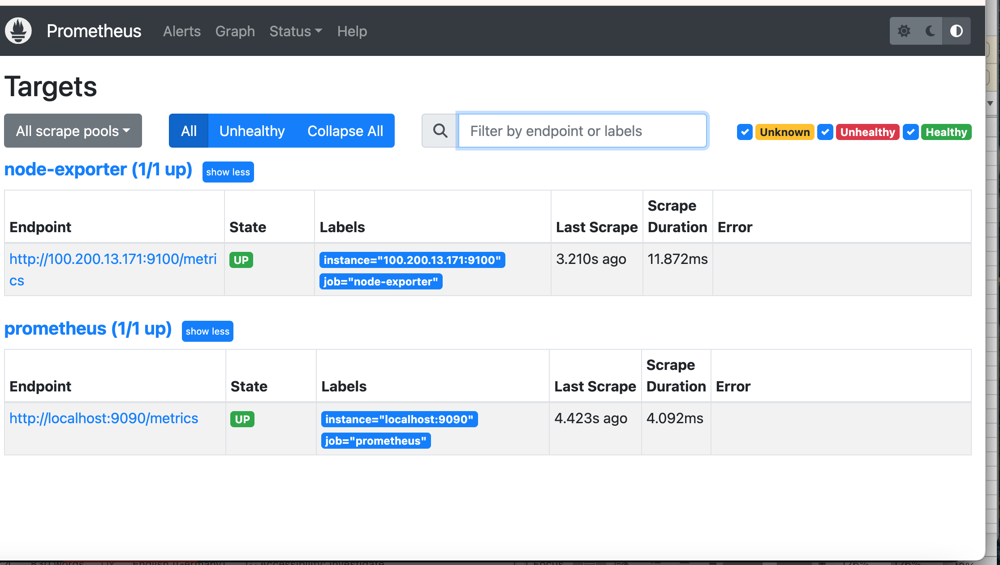
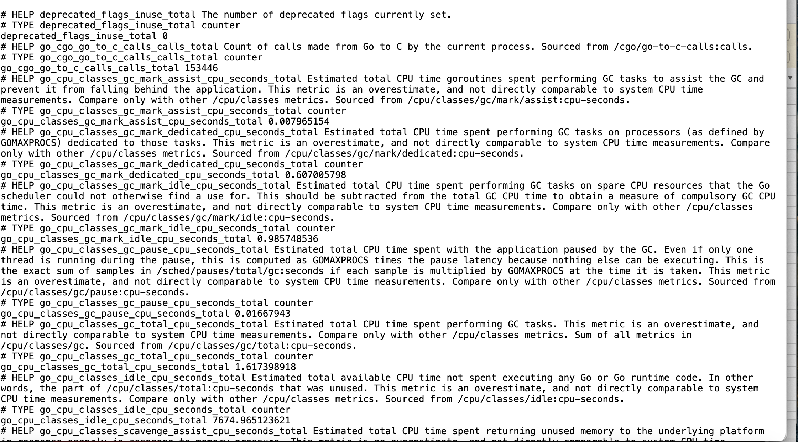

###  Monitoring and Alerting System with Prometheus + Grafana on AWS:

####  project summery:
This project sets up a complete monitoring and alerting system on AWS using Prometheus for metrics collection, Grafana for visualization, and Alertmanager for notifications, deployed across EC2 instances to monitor system and application performance in real-time.

• **Visualization commands** = Grafana Server

• **Monitoring setup** = Prometheus Server

• **Infrastructure commands** = Your local computer


### Step 1. Create a vpc

```bash
 VPC_ID=$(aws ec2 create-vpc \
    --cidr-block 100.200.0.0/16 \
    --query 'Vpc.VpcId' \
    --output text)
    
```
- To see your vpc ID
```bash
echo $VPC_ID
```
- Add a name tag to the vpc:
```bash
aws ec2 create-tags --resources $VPC_ID --tags Key=Name,Value=prometheus-vpc
```

Note: copy Down your vpc ID 

### Step 2. Create Internet Gateway

```bash
IGW_ID=$(aws ec2 create-internet-gateway \
  --query 'InternetGateway.InternetGatewayId' \
  --output text)
```
- view internet gateway id you created:
```bash
echo $IGW_ID
```
- Attach igw to a vpc:
```bash
aws ec2 attach-internet-gateway --vpc-id $VPC_ID --internet-gateway-id $IGW_ID

aws ec2 create-tags --resources $IGW_ID --tags Key=Name,Value=prometheus-igw
```
- Add a tag your igw:
```bash
aws ec2 create-tags --resources $IGW_ID --tags Key=Name,Value=prometheus-igw
```
Note: copy Down the internet gateway ID

### Step 3. Create a subnet:
```bash
UBNET_ID=$(aws ec2 create-subnet \
    --vpc-id $VPC_ID \
    --cidr-block 100.200.10.0/20 \
    --availability-zone us-east-1a \
    --query 'Subnet.SubnetId' \
    --output text)
```
- View subnet ID:
```bash
echo "Subnet ID: $SUBNET_ID
```
- enable auto assigned IP: 
```bash
aws ec2 modify-subnet-attribute \
  --subnet-id subnet-<subnet-ID> \
  --map-public-ip-on-launch
```
- tag the subnet:
```bash
aws ec2 create-tags \
  --resources subnet-0151f829e256c7c87 \
  --tags Key=Name,Value=prometheus-subnet
```
#### Step 4. Create a route table:
```bash
ROUTE_TABLE_ID=$(aws ec2 create-route-table \
    --vpc-id vpc-<vpc-ID> \
    --query 'RouteTable.RouteTableId' \
    --output text)
```
View route table ID:
```bash
echo "Route Table ID: $ROUTE_TABLE_ID"
```
Note: copy down your rtb-ID

- Create route to the internet gateway:
```bash
aws ec2 create-route \
    --route-table-id rtb-<rtb-ID>\
    --destination-cidr-block 0.0.0.0/0 \
    --gateway-id igw-<igw-ID>
```
- Associate Route Tble to a subnet:
```bash
aws ec2 associate-route-table \
    --subnet-id subnet-<subnet-id>\
    --route-table-id rtb-<rtb-id>
```
- Tag route table:
```bash
aws ec2 create-tags \
    --resources rtb-<rtb-id> \
    --tags Key=Name,Value=prometheus-rt
```
### Step 4. Create Security Group
```bash
aws ec2 create-security-group \
    --group-name prometheus-sg \
    --description "Security group for Prometheus monitoring" \
    --vpc-id vpc-<vpc-id> \
    --query 'GroupId' \
    --output text
```
- View sg- Id:
```bash
echo "Security Group ID: $SG_ID"
```
Note: copy Down the sg-id

- ### Add Rules:

- add ssh rule:
```bash
 aws ec2 authorize-security-group-ingress \
    --group-id $SG_ID \
    --protocol tcp \
    --port 22 \
    --cidr 0.0.0.0/0
```
- Add Prometheus rule:
```bash
aws ec2 authorize-security-group-ingress \
    --group-id $SG_ID \
    --protocol tcp \
    --port 9090 \
    --cidr 0.0.0.0/0
```
 - Add Grafana rule:
 ```bash
aws ec2 authorize-security-group-ingress \
    --group-id $SG_ID \
    --protocol tcp \
    --port 3000 \
    --cidr 0.0.0.0/0   
```
- Add Node Exporter rule:
```bash
aws ec2 authorize-security-group-ingress \
    --group-id $SG_ID \
    --protocol tcp \
    --port 9100 \
    --cidr 0.0.0.0/0    
```
- Tag security group (sg):
```bash
aws ec2 create-tags \
    --resources $SG_ID \
    --tags Key=Name,Value=prometheus-sg
```
-  Test: Verify security group rules:
```bash
aws ec2 describe-security-groups --group-ids $SG_ID
```


### Step 5. Create a machine image
```bash
AMI_ID=$(aws ec2 describe-images \
    --owners 099720109477 \
    --filters "Name=name,Values=ubuntu/images/hvm-ssd/ubuntu-jammy-22.04-amd64-server-*" \
    --query 'Images | sort_by(@, &CreationDate) | [-1].ImageId' \
    --output text)
```
- view machine image ID: 
```bash
echo "Ubuntu AMI ID: $AMI_ID"
```
Note: copy down the AMI ID

###  Create key pair
```bash
aws ec2 create-key-pair \
    --key-name my-prometheus-key \
    --query 'KeyMaterial' \
    --output text > my-prometheus-key.pem
```

- Set the permission to make it executable:
```bash
chmod 400 my-prometheus-key.pem
```
- Verify that the key-pair was created
```bash
aws ec2 describe-key-pairs --key-names my-prometheus-key
```


### Step 6.Launch EC2 Instances
### Node Exporter instance
```bash
NODE_INSTANCE_ID=$(aws ec2 run-instances \
  --image-id ami-<ami-ID> \
  --count 1 \
  --instance-type t3.micro \
  --key-name my-prometheus-key \
  --security-group-ids sg-<sg-ID> \
  --subnet-id subnet-<subnet-ID> \
  --tag-specifications 'ResourceType=instance,Tags=[{Key=Name,Value=Node-Exporter-Server}]' \
  --query 'Instances[0].InstanceId' \
  --output text)
```
- view Node Exporter ID: 
```bash
echo "Node Exporter Instance ID: $NODE_INSTANCE_ID"
```
### Get Node Exporter IPs
- Public IP
```bash
NODE_PUBLIC_IP=$(aws ec2 describe-instances \
    --instance-ids $NODE_INSTANCE_ID \
    --query 'Reservations[0].Instances[0].PublicIpAddress' \
    --output text)
```
- view public IP:
```bash
echo "Node Exporter Public IP: $NODE_PUBLIC_IP"
```
Note: Copy Down Public Ip

- Private IP
```bash
NODE_PRIVATE_IP=$(aws ec2 describe-instances \
    --instance-ids $NODE_INSTANCE_ID \
    --query 'Reservations[0].Instances[0].PrivateIpAddress' \
    --output text)
 ```
 - View private Ip
```bash
echo "Node Exporter Private IP: $NODE_PRIVATE_IP"
```
- Note: Copy Down private ip 

### Step 7. Launch Prometheus Server
   ```bash
   PROMETHEUS_INSTANCE_ID=$(aws ec2 run-instances \
  --image-id ami-<ami-id> \
  --count 1 \
  --instance-type t3.micro \
  --key-name my-prometheus-key \
  --security-group-ids sg-<sg-id> \
  --subnet-id subnet-<subnet-id> \
  --tag-specifications 'ResourceType=instance,Tags=[{Key=Name,Value=Prometheus-Grafana-Server}]' \
  --query 'Instances[0].InstanceId' \
  --output text)
```
- view instance ID:
```bash
echo "Prometheus Instance ID: $PROMETHEUS_INSTANCE_ID"
```
- Get public IP:
```bash
PROMETHEUS_PUBLIC_IP=$(aws ec2 describe-instances \
    --instance-ids $PROMETHEUS_INSTANCE_ID \
    --query 'Reservations[0].Instances[0].PublicIpAddress' \
    --output text)
```
- view public IP:
```bash
echo "Prometheus Public IP: $PROMETHEUS_PUBLIC_IP"
```
- note: copy Down ip 

### test and confirm if both instances are running:
```bash
aws ec2 describe-instances \
    --instance-ids $NODE_INSTANCE_ID $PROMETHEUS_INSTANCE_ID \
    --query 'Reservations[*].Instances[*].[InstanceId,State.Name,PublicIpAddress,Tags[?Key==`Name`].Value|[0]]' \
    --output table
```


### Step 8. install Prometheus
- ssh into Prometheus server:
```bash
ssh -i <.pem-file> ubuntu@<Prometheus-public-IP>
```
- 1. Update server prometheus server:
```bash
sudo apt update -y
```
- 2. creates a system user named:
```bash
sudo useradd --no-create-home --shell /bin/false prometheus
```
- 3. Make Directory:
```bash
sudo mkdir /etc/prometheus /var/lib/prometheus
```
- 4. Give Prometheus the necessary permissions to access and manage its configuration and data.
```bash
sudo chown prometheus:prometheus /etc/prometheus /var/lib/prometheus
```
- 5. navigates to the /tmp directory and then downloads the Prometheus v2.45.0 Linux binary archive (tar.gz) from the official GitHub releases page.
```bash
cd /tmp && wget https://github.com/prometheus/prometheus/releases/download/v2.45.0/prometheus-2.45.0.linux-amd64.tar.gz
```
- 6. extracts the downloaded Prometheus archive file so its contents (binaries, configuration files, etc.) can be accessed and used for installation or setup.
```bash
tar xvf prometheus-2.45.0.linux-amd64.tar.gz
```
- 7. change the current directory to the extracted Prometheus folder, so you can access its files (like the Prometheus binary and configuration files) for further setup or installation steps.
```bash
cd prometheus-2.45.0.linux-amd64
```
- 8. Make accessable syster-wide:
```bash
sudo cp prometheus promtool /usr/local/bin/
```
- 9. changes the ownership of the Prometheus binaries to user and group, ensuring that only the Prometheus service can execute or modify them, enhancing security.
```bash
sudo chown prometheus:prometheus /usr/local/bin/prometheus /usr/local/bin/promtool
```
- 10. copy the Prometheus web interface files into the directory, which is the default configuration location Prometheus uses to serve its built-in dashboards and visualizations.
```bash
sudo cp -r consoles console_libraries /etc/prometheus/
```
- 11.  change the ownership of the prometheus/ directory and all its contents to the prometheus user and group, ensuring Prometheus has the required permissions to read its configuration and UI files.
```bash
sudo chown -R prometheus:prometheus /etc/prometheus/
```
### Step 9.  Create Prometheus config file
- 1.  opens the Prometheus configuration file using the nano text editor
```bash
sudo nano /etc/prometheus/prometheus.yml
```
- 2. Copy and paste this text (replace YOUR_NODE_EXPORTER_PRIVATE_IP):
```bash
global:
  scrape_interval: 15s

scrape_configs:
  - job_name: 'prometheus'
    static_configs:
      - targets: ['localhost:9090']

  - job_name: 'node-exporter'
    static_configs:
      - targets: ['YOUR_NODE_EXPORTER_PRIVATE_IP:9100']
```
- Save the file: Press Ctrl+X, then Y, then Enter

- restor ownership to make sure Prometheus can access and use the updated config without permission issues.
```bash
sudo chown prometheus:prometheus /etc/prometheus/prometheus.yml
```

### Step 10. Create Prometheus service
```bash
sudo nano /etc/systemd/system/prometheus.service
```
- in the nano text editor past:
```bash
[Unit]
Description=Prometheus
After=network.target

[Service]
User=prometheus
Group=prometheus
Type=simple
ExecStart=/usr/local/bin/prometheus --config.file /etc/prometheus/prometheus.yml --storage.tsdb.path /var/lib/prometheus/

[Install]
WantedBy=multi-user.target
```

Save the file: Press Ctrl+X, then Y, then Enter

- 1. Start Prometheus:
```bash
sudo systemctl daemon-reload
```
```bash
sudo systemctl start prometheus
```
```bash
sudo systemctl enable prometheus
```
- 2. Test: Open your browser and go to http://<PROMETHEUS_PUBLIC_IP>:9090



### Step 11. Install Grafana (on same server)
```bash
sudo apt-get install -y software-properties-common wget
```
```bash
wget -q -O - https://packages.grafana.com/gpg.key | sudo apt-key add -
```
```bash
echo "deb https://packages.grafana.com/oss/deb stable main" | sudo tee -a /etc/apt/sources.list.d/grafana.list
```
```bash
sudo apt-get update && sudo apt-get install grafana
```
```bash
sudo systemctl start grafana-server
```
```bash
sudo systemctl enable grafana-server
```

- 1. Test: Open browser and go to http://<YOUR_PROMETHEUS_PUBLIC_IP>:3000

-  **Login:** admin
-  **Password:** admin
-  **Change password when asked**



### Step 12. Connect to Second Server and Install Node Exporter
** Open a NEW terminal/command prompt window
- ssh -i <pem-file> ubuntu@<exporter-public-ip>

```bash
sudo apt update -y
```
```bash
sudo useradd --no-create-home --shell /bin/false node_exporter
```
```bash
cd /tmp && wget https://github.com/prometheus/node_exporter/releases/download/v1.6.1/node_exporter-1.6.1.linux-amd64.tar.gz
```
```bash
tar xvf node_exporter-1.6.1.linux-amd64.tar.gz
```
```bash
cd node_exporter-1.6.1.linux-amd64
```
```bash
sudo cp node_exporter /usr/local/bin
```
```bash
sudo chown node_exporter:node_exporter /usr/local/bin/node_exporter
```
```bash
sudo nano /etc/systemd/system/node_exporter.service
```
- in the nano text editor past this:
```bash
[Unit]
Description=Node Exporter
After=network.target

[Service]
User=node_exporter
Group=node_exporter
Type=simple
ExecStart=/usr/local/bin/node_exporter

[Install]
WantedBy=multi-user.target
```
Save the file: Press Ctrl+X, then Y, then Enter

```bash
sudo systemctl daemon-reload
```
```bash
sudo systemctl start node_exporter
```
```bash
sudo systemctl enable node_exporter
```
-  Test: Open your browser and go to http://YOUR_NODE_EXPORTER_PUBLIC_IP:9100/metrics
You should see lots of metrics data



### Step 13.  Set up Grafana Dashboard
1. Login to Grafana (admin/your-password)
2. Click "Data Sources"
3. Click "Add data source"
4. Click "Prometheus"
5. URL: http://localhost:9090
6. Click "Save & Test" - should show green "Data source is working


###  Import a Dashboard
1. Click "+" icon on left sidebar
2. Click "Import"
3. Dashboard ID: 1860
4. Click "Load"
5. Select "Prometheus" from dropdown
6. Click "Import"

- You should see: A dashboard with CPU, Memory, Disk metrics.


### Step 14. FINAL TEST - Everything Working

Open these URLs in your browser:

1. Prometheus: http://YOUR_PROMETHEUS_PUBLIC_IP:9090
   • Go to Status → Targets
   • Both should show "UP"
   

2. Grafana: http://YOUR_PROMETHEUS_PUBLIC_IP:3000
   • Should show dashboard with live data

3. Node Exporter: http://YOUR_NODE_EXPORTER_PUBLIC_IP:9100/metrics
   • Should show raw metrics
    
    


