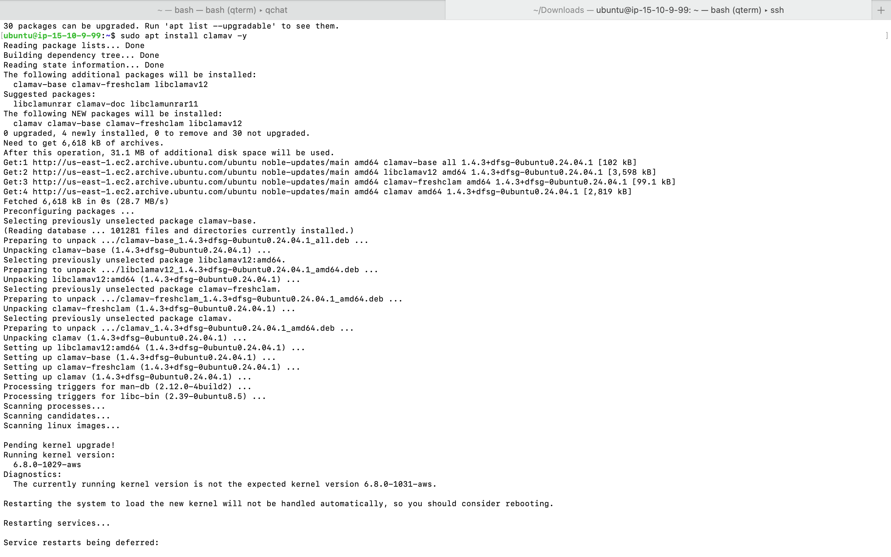
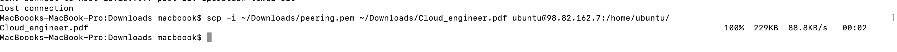
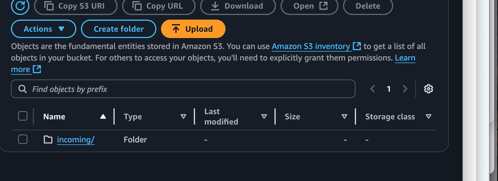
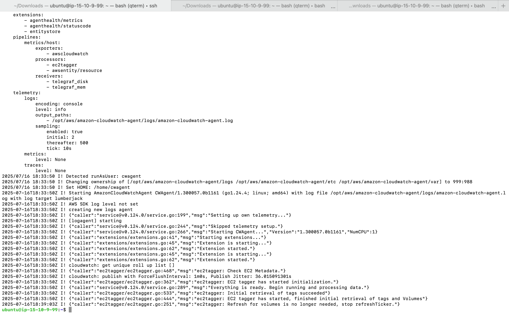
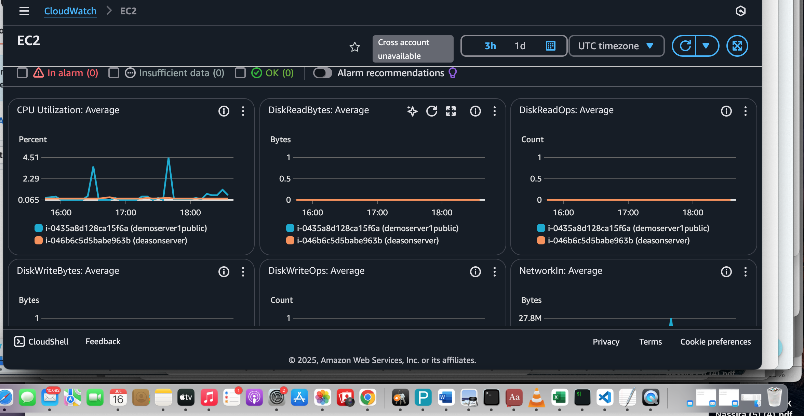

### Secure File Upload & Virus Scanning System on AWS
 
This project builds a secure file upload system on AWS where user-uploaded files are scanned for malware using ClamAV on an EC2 instance before being safely stored in S3, protecting applications from malicious uploads.
### Step 1 Create s3 for file storage

create a bucket foe uploading your secured file.
- Bucket name: secure-upload-bucket
- leave everything in default an create bucket
### create a second bucket

 for storing quarantine/infected files:

 - Bucket name: quarantine-bucket
 - leave everything in default and create bucket

- ### Step 2. IAM
- Create rote
- AWS Service
- Use case: Ec2
- Add permissions: select Ec2 full access and S3 full access
- role name: file scanning
- create

 ### Step 3. create your server (EC2)
EC2 Server is created to run ClamAV for scanning uploaded files for viruses, ensuring they’re safe before storing them in S3.
- lunch instance
- AMI: Ubuntu 
- Type: t2.micro 
- key pair: create one if you don't have, if you have yo can also use the already exiting one
- associate your vpc and your subnet
- enable auto assign public ip
- security group allow ``` ssh port 22 taffic 0.0.0.0/0  
- and ```http traffic 0.0.0.0/0``
- lunche instance 
- At the action Drop Down select-security-modify IAM role, and select your iam role and save.

### Step 4. SSH

On your terminal use the bash command ```chmod 700 <.pem>``` enter (to make it excutable)

- cd to your Downloads or the location of your .pem file
- To ssh: ```ssh -i <peering.pem> ubuntu@< public-ip>```

output: 

### now you are in your server
- Update your server: ``` sudo apt update```
- install ClamAV (antivirus engine): ```sudo apt install clamav -y```



- Update ClamAV engine to the latest version: ```sudo freshclam```
- install virtual environment: 
```sudo apt install python3-venv -y
python3 -m venv myenv
source myenv/bin/activate
pip install boto3
```

create a virus_scan.py file ```nano virus_scan.py``` : to past your script 
- in your nano editor press Ctl+O then hit enter to save and then ctl+X to exit

- note: replace bucket name with you actual bucket name and quarantine bucket name and attach the name of the file you want to upload to s3. **Note:** if its a picture the name will end with .png if its a pdf file, the name will end with .pdf

- exit your ubuntu terminal  ```exit+ enter```

- use this command to copy the absolute path of you file: ```scp -i ~/Downloads/peering.pem ~/Downloads/Cloud_engineer.pdf ubuntu@<public-ipv4address>:/home/ubuntu/``` 
**modify this command to suit for file and directory path** 

Note:This command securely copies the file Cloud_engineer.pdf from your Mac/window Downloads folder to the /home/ubuntu/ directory on your EC2 instance using the SSH private key e.g ```peering.pem``` for authentication. make sure to add your file name, your public-ip and your .pemfile name


 
 - Copy the file from your ec2 instance to your s3 bucket ```aws s3 cp /home/ubuntu/Cloud_engineer.pdf s3://secure-upload-bucket-re/incoming/```

 Note: if it is successfull you will see an output like this:```upload: ./Cloud_engineer.pdf to s3://secure-upload-bucket-re/incoming/Cloud_engineer.pdf```

 - also go to your s3 console and comfirm that the file is there. 
 

 ### Step 5. Install CloudWatch Agent
 - sudo apt update

- Download Debian package:```wget https://s3.amazonaws.com/amazoncloudwatch-agent/ubuntu/amd64/latest/amazon-cloudwatch-agent.deb```
 (software installer): 

Note:A Debian package is a file that makes it easy to install software on Debian-based Linux systems like Ubuntu.

- install the package: ```sudo dpkg -i -E ./amazon-cloudwatch-agent.deb```

- verify your installaion (optional): ```/opt/aws/amazon-cloudwatch-agent/bin/amazon-cloudwatch-agent-ctl -v```

 Configure the agent: ```sudo /opt/aws/amazon-cloudwatch-agent/bin/amazon-cloudwatch-agent-config-wizard```

- ```nano /home/ubuntu/cloudwatch-config.json``` and past the script  ```ctl-O enter ctl+X enter```

- Note: This script Allows EC2 to access Parameter Store, which safely stores settings or secrets; without it, EC2 apps like CloudWatch Agent can’t load their configs. 

- run this script: 
```bash
sudo /opt/aws/amazon-cloudwatch-agent/bin/amazon-cloudwatch-agent-ctl \
    -a stop
```

```bash
sudo /opt/aws/amazon-cloudwatch-agent/bin/amazon-cloudwatch-agent-ctl \
    -a start \
    -m ec2 \
    -c file:/home/ubuntu/cloudwatch-config.json   
```

**Note:** this script stops and then starts the CloudWatch Agent on your EC2, telling it to run using the settings saved in your local config file (cloudwatch-config.json) so it knows what system metrics to collect and send to CloudWatch.

- run this script to ensure your cloudwatch agent is running
```bash
sudo /opt/aws/amazon-cloudwatch-agent/bin/amazon-cloudwatch-agent-ctl -a status
```

- if its running this will be the output:
```bash
{
  "status": "running",
  "starttime": "2025-07-16T18:33:50+00:00",
  "configstatus": "configured",
  "version": "1.300057.0b1161"
}
```
- Run this command to view your logs on your terminal (optional)

```cat /opt/aws/amazon-cloudwatch-agent/logs/amazon-cloudwatch-agent.log```

Result 


### final step
- in your console, go to cloudwatch 
- metric - select your cloudwatch metrics



here's a sample json description of the cloudwatch config
```bash
{
  "agent": {
    "metrics_collection_interval": 60,
    "run_as_user": "root"
  },
  "metrics": {
    "append_dimensions": {
      "InstanceId": "${aws:InstanceId}"
    },
    "metrics_collected": {
      "cpu": {
        "measurement": [
          "cpu_usage_idle",
          "cpu_usage_iowait"
        ],
        "metrics_collection_interval": 60
      }
    }
  }
```


 


