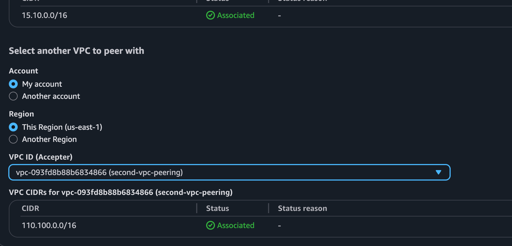
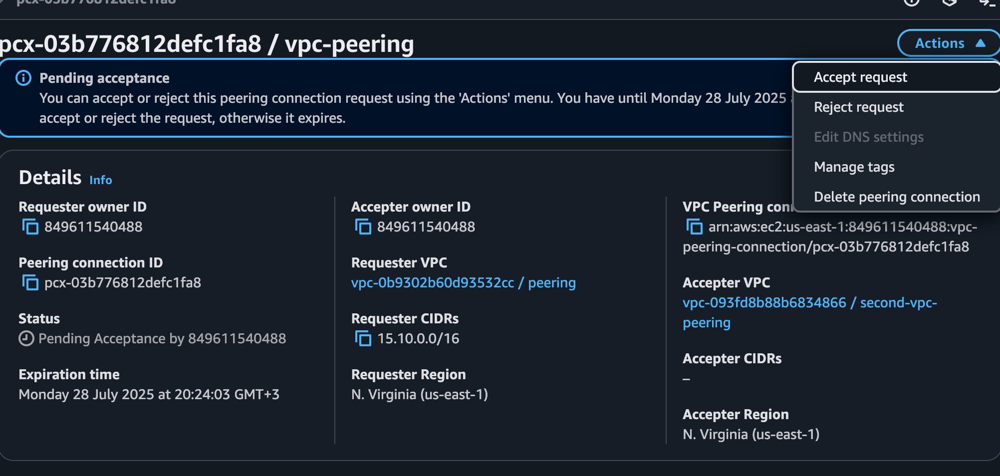
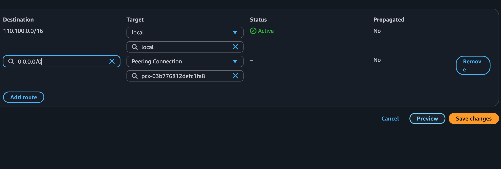
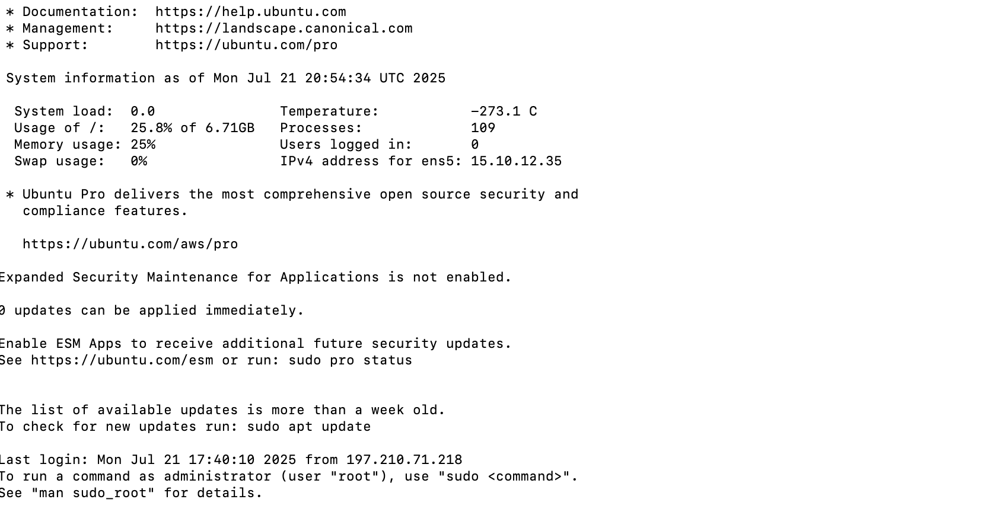

### Cross-VPC Communication Architecture with AWS VPC peering
This project demonstrates how to establish secure, private communication between two Virtual Private Clouds (VPCs) using AWS VPC Peering. It covers the design, configuration, and verification of connectivity, ensuring resources in different VPCs can communicate without traversing the public internet. The goal is to enable efficient cross-VPC communication for applications requiring network segmentation, security, and scalability.
Note: each vpc will have two subnet
one subnet for public the other for beason host or jump server (private).
### Step 1. Create VPC
- In The management Console navigate to Vpc
- Create VPC 
- Name: Demovpc1
- ip: 15.10.0.0/16
- Create VPC
### Step 2. Create a Subnet (subnet 1)
- In the Vpc console by your right click subnet
- Create subnet 
- Name: Demosubnet1 (any name of choice)
- Selete the new vpc created
- Availablity Zone: us east1
- subnet cider: 15.10.10.0/20
- create Subnet
- Note: the subnet must fall within your vpc cider
- Edith subnet and enable auto-assign IP address
###  Step 3. subnet2
- Name: Demosubnet2
- Selete your vpc
- Selete any AZ of choice
- subnet cider: 15.10.20.0/20
- Create subnet
- Edith subnet and enable auto-assign IP address
### Step 4. create internet Gateway
- In the Vpc console by your right click internet gateway
- click creat igw
- Name: Demoigw
- attach your internet gateway to your vpc
- click create
### Step 5. Create a Net Gateway
NOTE: am creating net gateway for the private subnet 
- Give your Net gateway a name 
- Selete one subnet that you want to be private
- Click allocate Elastic IP
- Click Create 
### Step 6. Create a Route Table(public subnet)
- Name: demoroute
- Selete your public subnet
- create route
- scroll down to edith route and click edith
- add: 0.0.0.0/0(traffic from anywhere)
- target Select internet gatway
- click save
### Step 7. create route for private subnet
- repete the same proceservers and selete Net gateway as your target
### Step 8. security Group
- Name: demosgpubic
- Attach your public subnet
- inbound rule: selete ssh and allow traffic from anyhere ```0.0.0.0/0```
- leeave the outbiund traffic as default
#### 9. security group private subnete
- Repet the same process 
### 10. create your ec2 
- Name: Demoinstancepublic
- Machine image: ubuntu
- select exiting key pair or create new one
- vpc: select your vpc 
- subnet: selete public subnet
- Enable auto assign public ip
- select public security group
- create
### Step 11. ssh to your Beason server (Jump server)
- in your terminal use the command ```chmod 700 <.key pair>``` to make it executable 
- Now use the command: ``` ssh -i <.key pair> ubuntu@<pubic ip> enter


### Step 12 ssh to your private server
- first to ssh to your private server, you will exit the server back to your Download or location where your pem file is and then   copy the private key from your Downloads to your Beason server ```scp -i <.pemfile name> <pemfile name> ubuntu@<public ip>:~/```
- Now ssh to your Beason-server ``` ssh -i <.pemfile> ubuntu@<public ip>``
- inside your Beason-server ssh to your private server ``` ssh -i <.pemfile> ubuntu@<private ip>


### Step 13 Create A private Vpc
- Create a vpc make sure the vpc do not overlaps with the existing vpc. ```110.100.0.0/16```
- Create a subnet name your subnet a name and attach your private vpc. subnete cider ``` 110.100.30.0/20```
and create
- create your second subnet give your subnet a name and attach your priavte vpc. subnet cider ```110.100.50.0/20``` and create
- Create a security group and attach your private vpc  allow ssh ```0.0.0.0/0```
and http ```0.0.0.0/0```
- Repeat the same process for the second Vpc
- Create a route table and ensure it has local. Repeat for the second route table.

### Step 14 Peering Connection

- Go to Peering Connections > Create Peering.
- VPC ID (Requester): Attach your public vpc
- VPC Accepter: Attach your private vpc
- create



- in your vpc peering connection find the ```ID``` and click, Navigate to action and click accept request.



(your peering status is now active)

### Step 15 Update ypur route
- Go to Route Table edith ```distination 0.0.0.0/0 target vpc peering```

 

save changes.

Repeat this for each of your rout and attach the peering connection to them.
### Step 16
create ec2 instance and attach your ```.pem fill```, scroll down to vpc and attach your ```private vpc``` and select a subnet, ```disable auto enable ip``` and attach a security group,  lunch instance.
Repeat the process for the second instance.
### Step 17 SSh TO YOUR SERVER
to ssh to your private server, go to termainal and ```cd Doawloads``` if your pem file is (in Downloads) if not ```cd to the location of your .pemfile```, Make it executable ```chmod 700 <.pemfilename>```.

- Copy your private key from your Downloads to your beason host(public server) ```scp -i <.pemfile name> <pemfile name> ubuntu@<public ip>:~/```. 

- inside your Beason-server ssh to your private server ``` ssh -i <.pemfile> ubuntu@<private ip>



you are now in the private server you can repeat this for each server.
Make sure to edit the ```ip``` to the ```private ip server you want to ssh into```


 