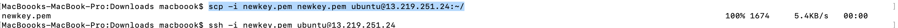

### Cross-VPC Communication Architecture with AWS VPC peering
This project demonstrates how to establish secure, private communication between two Virtual Private Clouds (VPCs) using AWS VPC Peering. It covers the design, configuration, and verification of connectivity, ensuring resources in different VPCs can communicate without traversing the public internet. The goal is to enable efficient cross-VPC communication for applications requiring network segmentation, security, and scalability.
Note: each vpc will have two subnet
one subnet for public the other for beason host or jump server (private).
### Step 1. Create VPC
- In The management Console navigate to Vpc
- Create VPC 
- Name: Demovpc1
- ip: 15.10.0.0/16
- Create VPC
### Step 2. Create a Subnet (subnet 1)
- In the Vpc console by your right click subnet
- Create subnet 
- Name: Demosubnet1 (any name of choice)
- Selete the new vpc created
- Availablity Zone: us east1
- subnet cider: 15.10.10.0/20
- create Subnet
- Note: the subnet must fall within your vpc cider
- Edith subnet and enable auto-assign IP address
###  Step 3. subnet2
- Name: Demosubnet2
- Selete your vpc
- Selete any AZ of choice
- subnet cider: 15.10.20.0/20
- Create subnet
- Edith subnet and enable auto-assign IP address
### Step 4. create internet Gateway
- In the Vpc console by your right click internet gateway
- click creat igw
- Name: Demoigw
- attach your internet gateway to your vpc
- click create
### Step 5. Create a Net Gateway
NOTE: am creating net gateway for the private subnet 
- Give your Net gateway a name 
- Selete one subnet that you want to be private
- Click allocate Elastic IP
- Click Create 
### Step 6. Create a Route Table(public subnet)
- Name: demoroute
- Selete your public subnet
- create route
- scroll down to edith route and click edith
- add: 0.0.0.0/0(traffic from anywhere)
- target Select internet gatway
- click save
### Step 7. create route for private subnet
- repete the same proceservers and selete Net gateway as your target
### Step 8. security Group
- Name: demosgpubic
- Attach your public subnet
- inbound rule: selete ssh and allow traffic from anyhere ```0.0.0.0/0```
- leeave the outbiund traffic as default
#### 9. security group private subnete
- Repet the same process 
### 10. create your ec2 
- Name: Demoinstancepublic
- Machine image: ubuntu
- select exiting key pair or create new one
- vpc: select your vpc 
- subnet: selete public subnet
- Enable auto assign public ip
- select public security group
- create
### Step 11. ssh to you server
- in your terminal use the command ```chmod 700 <.key pair>``` to make it executable 
- Now use the command: ``` ssh -i <.key pair> ubuntu@<pubic ip> enter




 